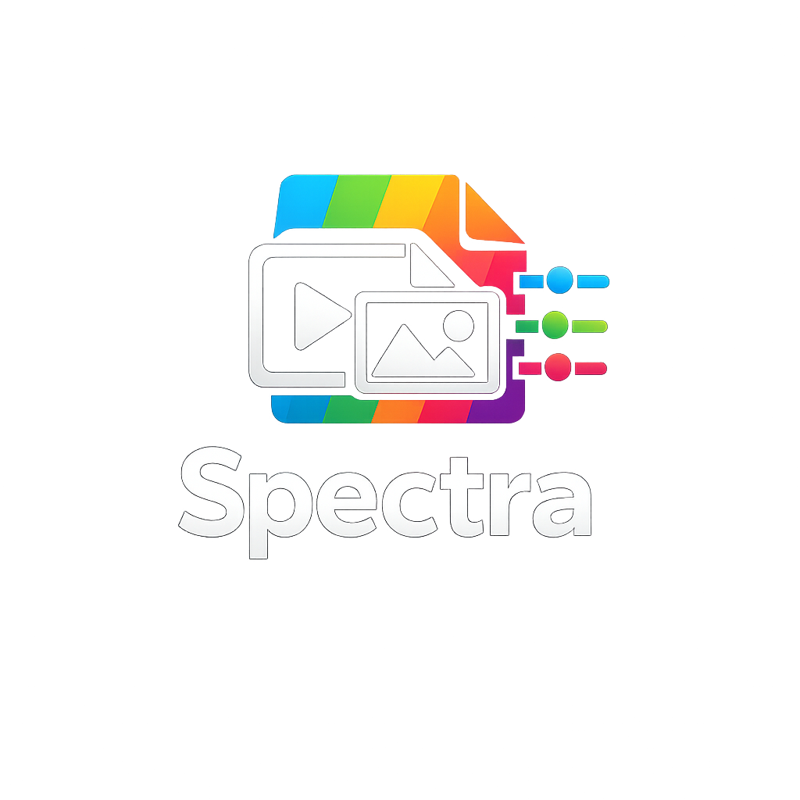
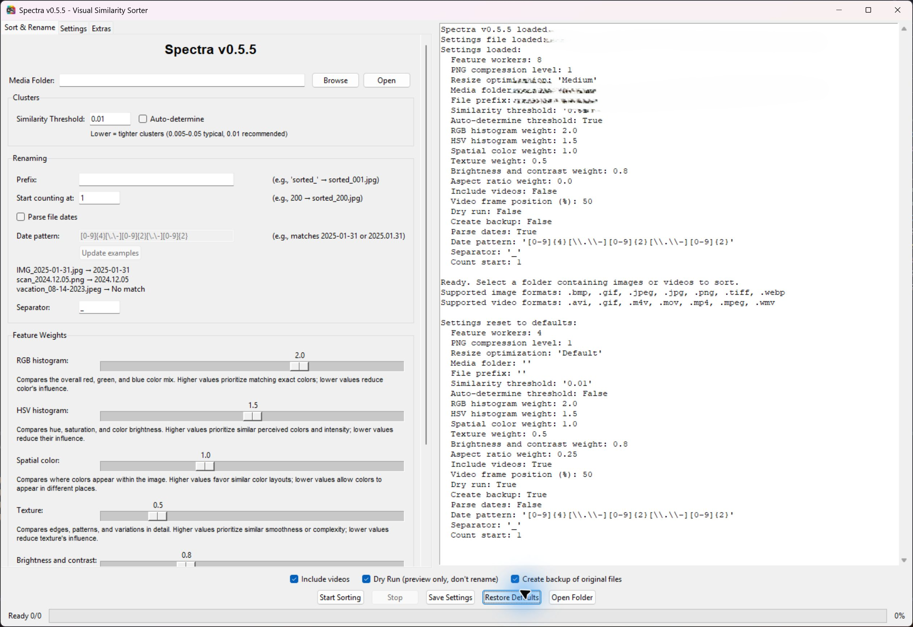

<center>

<h3>Intelligent image/video sorting by visual similarity</h3>
<p>Spectra sorts and renames images and videos by visual similarity, using color, spatial layout, texture, brightness, and aspect ratio.</p>
</center>


<p align="center">
  
  
  
</p>



---

## ✨ Features

- **🔍 Multi-dimensional visual analysis**: Extracts color histograms, spatial patterns, texture features, brightness metrics, and aspect ratio
- **🧩 Smart clustering**: Uses DBSCAN algorithm to group visually similar images
- **🔄 Nearest-neighbor sorting**: Creates smooth visual transitions within and between clusters
- **🖥️ User-friendly GUI**: Clean Tkinter interface—no command line needed
- **🛡️ Safe operations**: Preview renaming with dry-run mode and optionally back up originals
- **📊 Detailed logging**: Real-time progress tracking and CSV mapping of all changes
- **⏱️ Live progress**: Stage-by-stage status, item counts, and completion percentage
- **⚙️ Customizable**: Adjustable similarity thresholds and filename prefixes
- **💡 Guided controls**: Clear similarity-weight descriptions and date-pattern examples
- **📂 Fast handoff**: Open the sorted folder and quit Spectra in one action

---

## 🚀 Quick start

### Install Spectra on Windows (recommended)

No development tools need to be installed beforehand. Setup downloads Python and installs the application dependencies.

1. Open the [latest Spectra release](https://github.com/electblake/Spectra/releases/latest).
2. Download the file ending in `windows-amd64-Setup.exe`.
3. Run the downloaded Setup executable.
4. Review the license, choose whether to create a desktop shortcut, and select **Install**.
5. Launch Spectra from the Start Menu, the optional desktop shortcut, or the final Setup page.

Setup installs Spectra for the current Windows user and supports upgrades and uninstall through Windows **Installed apps**.

After installation, use **Extras > Install > Check for Updates** to download and open the latest GitHub release Setup executable.

### Portable version

For an installation-free copy, download the file ending in `windows-amd64-portable.zip` from the [latest release](https://github.com/electblake/Spectra/releases/latest), extract the entire archive, and run the Spectra executable inside the extracted folder.

---

## 📖 How it works

### 1. Feature extraction

Spectra analyzes each image across multiple dimensions:

- **RGB & HSV color histograms**: Captures overall color distribution
- **Spatial color features**: Tracks color placement in a 4×4 grid
- **Texture analysis**: Detects edges, patterns, and variance
- **Brightness & contrast**: Measures tonal characteristics

### 2. Intelligent clustering

Uses DBSCAN (Density-Based Spatial Clustering) to:

- Group images with similar visual characteristics
- Determine clusters from the selected similarity threshold

### 3. Sequential ordering

- Sorts images within clusters using nearest-neighbor algorithm
- Orders clusters for smooth visual transitions
- Optimizes connections between cluster boundaries

### 4. Safe renaming

- Renames files sequentially; number padding depends on the final counter value
- Creates backup of originals (optional)
- Generates CSV mapping file for reference

---

## 🎯 Use cases

- **📸 Photo collections**: Organize vacation photos by scene and color
- **🎨 Design assets**: Sort product images, textures, or color palettes
- **🖼️ Digital art**: Arrange artwork by style and composition
- **📱 Screenshots**: Group similar UI states or app screens
- **🏠 Home organization**: Sort scanned documents or family photos

---

## 🛠️ Usage guide

### Basic workflow

1. **Launch Spectra** from the Start Menu or desktop shortcut.

2. **Select your image folder**
   - Click "Browse" to choose your image directory
   - Supported formats: JPG, JPEG, PNG, BMP, GIF, TIFF, WEBP

3. **Configure settings**
   - **File prefix**: Add a prefix to sorted filenames (optional)
   - **Similarity threshold**: Lower values = tighter grouping (0.005-0.05 typical)
   - **Auto-determine**: Estimate a threshold from nearest-neighbor distances
   - **Dry run**: Preview changes without modifying files
   - **Create backup**: Saves originals to `backup_originals/` folder

4. **Start sorting**
   - Click "Start Sorting"
   - Monitor progress in the log window
   - Review results and mapping file

---

## 📊 Output files

Example output for three images with prefix `sorted_`, counting from `1`, with backups enabled and dry run disabled:

```
your-image-folder/
├── sorted_1.jpg            # Renamed images in order
├── sorted_2.jpg
├── sorted_3.png
├── rename_mapping.csv      # Original → New name mapping
└── backup_originals/       # Original files (if backup enabled)
    ├── IMG_5234.jpg
    ├── DSC_0891.jpg
    └── photo.png
```

### Mapping file format

```csv
Original Name,New Name
"IMG_5234.jpg","sorted_1.jpg"
"DSC_0891.jpg","sorted_2.jpg"
"photo.png","sorted_3.png"
```

---

## 🎛️ Configuration

The **Settings** tab controls processing performance:

- **Image feature workers:** concurrent image analysis threads, default **4**.
- **Video frame workers:** concurrent video frame extraction processes, default **1**. Each worker processes one video at a time with one decoder thread.

The **Image processing** group contains:

- **PNG compression level:** temporary video frame compression from **0–9**, default **1**. Lower levels encode faster but produce larger files; pixels are unchanged.
- **Image resize optimization:** **Default** keeps the original LANCZOS resize; **Low**, **Medium**, and **High** use Pillow `reducing_gap` values of **3.0**, **2.0**, and **1.0**. Higher optimization can be faster but may slightly change similarity scores and ordering. Analysis stays at 100×100 pixels and original files are unchanged.

Changes apply to the next run. **Save Settings** persists these options, and **Restore Defaults** resets them.

Existing `settings.ini` files require this section before launching the updated app:

```ini
[performance]
feature_workers = 4
video_workers = 1
png_compress_level = 1
resize_optimization = Default
```

### Similarity threshold guidelines

| Threshold | Clustering behavior |
|-----------|---------------------|
| 0.005-0.01 | Very tight—only nearly identical images grouped |
| 0.01-0.02 | Moderate—similar colors and compositions |
| 0.02-0.05 | Loose—broader visual themes |
| Auto | Spectra calculates based on your dataset |

---

## 🔒 Safety features

- ✅ **Dry run mode**: Preview all changes before committing
- ✅ **Optional backups**: Copies originals to `backup_originals/` when enabled
- ✅ **Mapping file**: CSV log of all filename changes
- ✅ **Original image data**: Renaming does not re-encode images
- ✅ **Error handling**: Skips problematic images with warnings

---

## 🤝 Contributing

Contributions are welcome!

## 📝 License

This project is licensed under the MIT License - see the [LICENSE](LICENSE) file for details.

---

## 🙏 Acknowledgments

- Built with [Pillow](https://python-pillow.org/) for image processing
- Powered by [scikit-learn](https://scikit-learn.org/) for clustering algorithms
- UI created with [Tkinter](https://docs.python.org/3/library/tkinter.html)

---

## 📧 Contact

**Questions? Suggestions? Issues?**

- 🐛 [Report a bug](https://github.com/electblake/Spectra/issues)
- 💡 [Request a feature](https://github.com/electblake/Spectra/issues)
- 📖 [Documentation](https://github.com/electblake/Spectra/wiki)

---

<p align="center">
  Made with ❤️ for photographers, designers, and digital hoarders everywhere
</p>

<p align="center">
  <sub>Star ⭐ this repo if you find it useful!</sub>
</p>
